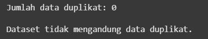
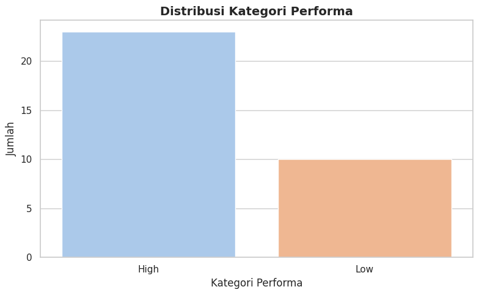

# Laporan Proyek Machine Learning - Firman Maulana

## Project Overview

Dengan kemajuan pesat dalam bidang teknologi, jumlah pilihan ponsel di pasaran semakin beragam, ditawarkan dengan berbagai fitur, spesifikasi, dan rentang harga. Bagi konsumen, menentukan ponsel yang paling sesuai dengan kebutuhan dan preferensi mereka sering kali menjadi proses yang membingungkan. Untuk itu, sistem rekomendasi berbasis teknologi hadir sebagai solusi guna membantu pengguna menemukan perangkat yang paling cocok, baik dari sisi spesifikasi teknis maupun pengalaman pengguna lain [[1]](#referensi-1).

Dalam pengembangan sistem rekomendasi ini, terdapat dua pendekatan utama yang digunakan, yaitu Content-based Filtering dan Collaborative Filtering. Content-based Filtering memberikan rekomendasi berdasarkan karakteristik atau fitur produk seperti harga, jenis prosesor, ukuran layar, dan kapasitas baterai yang sesuai dengan preferensi pengguna. Sementara itu, Collaborative Filtering memanfaatkan data interaksi pengguna, seperti ulasan, rating, atau histori pembelian, untuk memberikan rekomendasi berdasarkan pola dan kebiasaan pengguna lain [[2]](#referensi-2).

Proyek ini bertujuan untuk membangun sebuah model sistem rekomendasi ponsel dengan memanfaatkan data spesifikasi perangkat serta data interaksi pengguna. Model ini akan menghasilkan daftar 5 ponsel terbaik yang disesuaikan dengan preferensi masing-masing pengguna. Dengan demikian, diharapkan sistem ini mampu meningkatkan pengalaman pengguna dan membantu mereka dalam mengambil keputusan pembelian yang lebih tepat [[3]](#referensi-3).

Proyek ini memiliki nilai penting karena beberapa alasan berikut:

1. **Efisiensi Waktu**: Sistem mampu menyaring ribuan opsi dan merekomendasikan 5 pilihan terbaik, sehingga mempermudah proses pengambilan keputusan.

2. **Rekomendasi yang Dipersonalisasi**: Menyediakan saran yang relevan, baik berdasarkan spesifikasi teknis maupun ulasan pengguna lain.

3. **Peningkatan Kepuasan Pengguna**: Membantu pengguna menemukan ponsel yang sesuai dengan kebutuhan mereka, termasuk opsi yang mungkin tidak terpikirkan sebelumnya.

## Referensi

<a name="referensi-1"></a>
[1] X. Su and T. M. Khoshgoftaar, "A survey of collaborative filtering techniques,"I, vol. 2009, pp. 1–19, 2009. doi:10.1155/2009/421425

<a name="referensi-2"></a>
[2] M. J. Pazzani and D. Billsus, "Content-based recommendation systems," in The Adaptive Web, Springer, 2007, pp. 325–341. doi:10.1007/978-3-540-72079-9_10

<a name="referensi-3"></a>
[3] F. Ricci, L. Rokach, and B. Shapira, "Introduction to recommender systems handbook," in Recommender Systems Handbook, Springer, 2011, pp. 1–35. doi:10.1007/978-0-387-85820-3_1

## Business Understanding

**Problem Statements**

1. Bagaimana memberikan rekomendasi ponsel yang relevan dan personal kepada pengguna berdasarkan karakteristik produk seperti brand dan spesifikasi teknis lainnya?
2. Bagaimana memanfaatkan pola rating dan interaksi pengguna untuk memberikan rekomendasi yang akurat berdasarkan preferensi pengguna serupa?

**Goals**
Berikut adalah tujuan yang ingin dicapai berdasarkan pernyataan masalah di atas:

1. Mengembangkan model rekomendasi berbasis Content-based Filtering yang mampu memberikan rekomendasi berdasarkan atribut brand ponsel menggunakan teknik TF-IDF.
2. Membuat model berbasis User-based Collaborative Filtering untuk memanfaatkan data rating pengguna dan memberikan rekomendasi berdasarkan pola perilaku pengguna serupa.

**Solution statements**
Untuk mencapai tujuan yang diinginkan, berikut adalah beberapa solusi yang diajukan:

1. Menggunakan Content-based Filtering:

   - Membuat model yang merekomendasikan ponsel berdasarkan kesamaan brand menggunakan fitur yang telah diekstrak.
   - Menggunakan algoritma TF-IDF untuk transformasi fitur brand dan cosine similarity untuk menghitung kesamaan antar produk ponsel.

2. Menggunakan User-based Collaborative Filtering:

   - Membuat model berbasis rating pengguna dengan membangun user-item matrix untuk menemukan pola rekomendasi.
   - Menerapkan pendekatan cosine similarity untuk mengidentifikasi pengguna dengan preferensi serupa dan memberikan rekomendasi berdasarkan rating dari pengguna tersebut.

## Data Understanding

Dataset yang digunakan berisi informasi tentang ponsel, data rating pengguna, dan detail pengguna terkait. Dataset ini dirancang untuk mendukung pengembangan sistem rekomendasi ponsel menggunakan **Content-based Filtering** dan **Collaborative Filtering**.

**Sumber Data**  
Dataset yang digunakan berasal dari [Kaggle - Cellphones Recommendations](https://www.kaggle.com/datasets/meirnizri/cellphones-recommendations/data)

**Informasi Dataset:**

Dataset terdiri dari tiga file utama:

1. **`cellphones_data.csv`**:

   - Berisi metadata ponsel yang dapat digunakan untuk **Content-based Filtering**.
   - **Dimensi**: 33 baris × 14 kolom.
   - **Kolom Utama**:
     - `cellphone_id`: ID unik untuk setiap ponsel.
     - `brand`: Merek/Brand ponsel .
     - `model`: Model/Type ponsel .
     - `operating system`: Sistem operasi ponsel.
     - `internal memory`: Kapasitas penyimpanan internal (GB).
     - `RAM`: Kapasitas RAM (GB).
     - `performance`: Skor kinerja ponsel.
     - `main camera`: Resolusi kamera utama (MP).
     - `selfie camera`: Resolusi kamera selfie (MP).
     - `battery size`: Kapasitas baterai (mAh).
     - `screen size`: Ukuran layar (inch).
     - `weight`: Berat ponsel (gram).
     - `price`: Harga ponsel.
     - `release date`: Tanggal rilis ponsel.

2. **`cellphones_ratings.csv`**:

   - Berisi data rating yang diberikan pengguna untuk ponsel tertentu, yang dapat digunakan untuk **Collaborative Filtering**.
   - **Dimensi**: 990 baris × 3 kolom.
   - **Kolom Utama**:
     - `user_id`: ID unik untuk setiap pengguna.
     - `cellphone_id`: ID unik untuk setiap ponsel.
     - `rating`: Rating yang diberikan pengguna (skala 1-5).

3. **`cellphones_users.csv`**:
   - Berisi informasi demografi pengguna yang dapat digunakan untuk analisis tambahan.
   - **Dimensi**: 99 baris × 4 kolom.
   - **Kolom Utama**:
     - `user_id`: ID unik pengguna.
     - `age`: Usia pengguna.
     - `gender`: Jenis kelamin pengguna.
     - `occupation`: Pekerjaan pengguna.

**Kondisi Data**

1. **_Missing Value_**

   

   > Fitur `occupation` memiliki nilai yang kosong (missing value)

2. **_Data Duplikat_**

   

   > Tidak terdapat data terduplikasi.

3. **_Data Tidak Valid_**

   

   

   > Pada kolom gender, terdapat data invalid berupa pilihan '-Select Gender-' yang perlu dibersihkan.  
   > Ditemukan kesalahan penulisan pada 'healthare', yang benar adalah 'healthcare'.  
   > Pekerjaan dengan kategori 'information technology' dan 'it' dapat digabungkan menjadi satu kelompok untuk mempermudah analisis.

## Exploratory Data Analysis (EDA)

1. **Statistik Deskriptif**

   

   

   

   1. **_Products_**

      Menampilkan ringkasan statistik dari 33 model ponsel:

      - Internal memory berkisar antara 32–512 GB, dengan rata-rata 148 GB.

      - RAM rata-rata sekitar 6.8 GB, minimum 3 GB dan maksimum 12 GB.

      - Main camera dan selfie camera memiliki variasi besar, dengan kamera utama tertinggi mencapai 108 MP.

      - Battery size rata-rata 4320 mAh, menunjukkan sebagian besar ponsel memiliki baterai besar.

      - Screen size umumnya berkisar antara 4.7 hingga 7.6 inci.

      - Price bervariasi cukup besar, dengan rata-rata $628 dan maksimum hampir $2000.

   2. **_Users_**

      - Terdapat 99 pengguna, dengan usia antara 21 hingga 61 tahun.

      - Usia rata-rata pengguna adalah sekitar 36 tahun, menunjukkan dominasi usia produktif.

   3. **_Ratings_**

      - Terdapat 990 data rating yang diberikan pengguna terhadap ponsel.

      - Rating berkisar dari 1 hingga 18, dengan rata-rata sekitar 6.7.

      - Distribusi rating menunjukkan nilai tengah di angka 7, dan mayoritas rating berada di rentang 5 hingga 9.

2. **Visualisasi Fitur**

   - **_Distribusi Jumlah Ponsel per Brand_**

     

     Grafik menunjukkan bahwa dari **10 brand** yang ada, Samsung memiliki **8 model** ponsel paling banyak, disusul Apple dengan **6 model**. Sementara itu, Asus, Oppo, Vivo, dan Sony tercatat hanya memiliki 1 model ponsel masing-masing.

   - **_Distribusi Tipe Setiap Brand_**

     **Daftar Model Berdasarkan Brand**
     | **Brand** | **Model** |
     |-------------|-----------------------------------------------------------------------------------------------------|
     | **Apple** | iPhone SE (2022), iPhone 13 Mini, iPhone 13, iPhone 13 Pro, iPhone 13 Pro Max, iPhone XR |
     | **Asus** | Zenfone 8 |
     | **Google** | Pixel 6, Pixel 6a, Pixel 6 Pro |
     | **Motorola**| Moto G Stylus (2022), Moto G Play (2021), Moto G Pure, Moto G Power (2022) |
     | **OnePlus** | Nord N20, Nord 2T, 10 Pro, 10T |
     | **Oppo** | Find X5 Pro |
     | **Samsung** | Galaxy A13, Galaxy A32, Galaxy A53, Galaxy S22, Galaxy S22 Plus, Galaxy S22 Ultra, Galaxy Z Flip 3, Galaxy Z Fold 3 |
     | **Sony** | Xperia Pro |
     | **Vivo** | X80 Pro |
     | **Xiaomi** | Redmi Note 11, 11T Pro, 12 Pro, Poco F4 |

     Terdapat total **33 model** ponsel yang berasal dari seluruh brand yang ada.

   - **_Distribusi Sistem Operasi_**

     

     Grafik tersebut menunjukkan bahwa sebagian besar model ponsel menggunakan sistem operasi **Android**, dengan total sebanyak **27 perangkat**. Sementara itu, hanya **6 perangkat** yang menggunakan sistem operasi **iOS**.

   - **_Distribusi Memory dan RAM_**

     

     Grafik tersebut menunjukkan sebagian besar perangkat yang tersedia dilengkapi dengan memori internal sebesar **128 GB** sebanyak **20 perangkat**, serta **RAM 8 GB** yang digunakan pada **13 perangkat**.

   - **_Distribusi Kategori Performa_**

     

     Rentang nilai performa berkisar antara 1,02 hingga 11,0, dengan kategori performa rendah untuk nilai di bawah 5 dan performa tinggi untuk nilai di atas 5. Grafik tersebut memperlihatkan bahwa dari total perangkat, terdapat **23 unit** dengan performa tinggi dan **10 unit** dengan performa rendah berdasarkan hasil pengujian menggunakan AnTuTu.

   - **_Distribusi Kategori Harga Ponsel_**

     

     Dari grafik tersebut, jumlah ponsel berdasarkan kategori harga menunjukkan bahwa terdapat **8 perangkat** pada kategori Entry Level (0-300 USD), **16** perangkat pada kategori Mid Level (301-800 USD), dan **9 perangkat** pada kategori Flagship dengan harga di atas 800 USD.

   - **_Analisis Review User_**

     

     Setiap pengguna memberikan jumlah ulasan yang sama, yakni sebanyak **10 ulasan**.

   - **_Distribusi Review per Tipe Ponsel_**

     

     Ponsel dengan jumlah ulasan terbanyak adalah **Moto G Play (2021)** dengan **41 ulasan**, sementara ponsel dengan ulasan paling sedikit adalah **iPhone SE (2022)** dan **10T**, masing-masing menerima **20 ulasan**.

   - **_Distribusi Rating_**

     

     Nilai rating berkisar antara 1 hingga 10. Rating yang paling sering muncul adalah nilai 8 dengan **195** kemunculan, sedangkan rating yang paling jarang diberikan adalah nilai 3 dengan **30** kemunculan. Selain itu, terdapat outlier pada nilai rating sebesar 18.

   - **_Distribusi Usia Pengguna_**

     

     Grafik menunjukkan mayoritas pengguna berusia **25–35 tahun**, dengan puncak pada usia **25 (12 pengguna)**. Usia termuda adalah **21** dan tertua **61**. Ini menunjukkan dominasi pengguna usia muda, yang penting dipertimbangkan dalam sistem rekomendasi.

   - **_Distribusi Gender Pengguna_**

     

     Grafik menunjukkan distribusi gender pengguna didominasi oleh **laki-laki (50 pengguna)** dan **perempuan (45 pengguna)**. Terdapat juga beberapa entri tidak valid atau kosong **(label "-Select Gender-")** sebanyak **4 pengguna**. Data ini penting untuk memastikan sistem rekomendasi bersifat inklusif terhadap seluruh gender.

   - **_Analisis Profesi Pengguna_**

     | **Profesi**                      | **Count** |
     | -------------------------------- | --------- |
     | accountant                       | 2         |
     | administrative officer           | 5         |
     | administrator                    | 1         |
     | banking                          | 1         |
     | business                         | 1         |
     | computer technician              | 1         |
     | construction                     | 2         |
     | data analyst                     | 2         |
     | education                        | 2         |
     | executive                        | 1         |
     | executive manager                | 1         |
     | finance                          | 2         |
     | healthare                        | 1         |
     | healthcare                       | 2         |
     | homemaker                        | 1         |
     | ict officer                      | 1         |
     | information                      | 1         |
     | information technology           | 12        |
     | it                               | 6         |
     | manager                          | 18        |
     | marketing                        | 1         |
     | master degree                    | 1         |
     | nurse                            | 1         |
     | ops manager                      | 1         |
     | president transportation company | 1         |
     | purchase manager                 | 1         |
     | qa software manager              | 1         |
     | registered                       | 1         |
     | retail                           | 1         |
     | sales                            | 3         |
     | sales manager                    | 2         |
     | security                         | 3         |
     | self employed                    | 1         |
     | software developer               | 4         |
     | system administrator             | 1         |
     | teacher                          | 1         |
     | team leader                      | 2         |
     | team worker in it                | 1         |
     | technical engineer               | 1         |
     | technician                       | 1         |
     | transportation                   | 1         |
     | warehousing                      | 1         |
     | web design                       | 1         |
     | worker                           | 2         |
     | writer                           | 1         |

     Berdasarkan Data Profesi Pengguna:

     - Terdapat **45 kategori** pekerjaan unik.

     - Pekerjaan terbanyak adalah manager sebanyak 18 pengguna, diikuti oleh information technology (12 pengguna) dan it (6 pengguna).

     - Ditemukan duplikasi makna pekerjaan, seperti information technology dan it, yang sebaiknya digabungkan untuk analisis lebih akurat.

     - Terdapat kesalahan penulisan pada healthare, yang seharusnya healthcare.

## Data Preparation

Pada tahap ini, dilakukan serangkaian proses untuk membersihkan dan mempersiapkan data sebelum dianalisis atau digunakan untuk pelatihan model. Langkah-langkah ini bertujuan untuk meningkatkan kualitas dan keandalan data.

**Teknik dan Proses Data Preparation**

1. **_Merged All Datasets_**
   Dataset `ratings`, `products`, dan `users` digabung menggunakan kolom `cellphone_id` dan `user_id`. Tujuan penggabungan ini adalah untuk membentuk satu dataset terpadu yang mencakup informasi lengkap dari pengguna, metadata produk (ponsel), dan interaksi dalam bentuk rating.

2. **_Check and Drop Missing Value_**
   Baris dengan nilai kosong (null) pada kolom `occupation` dihapus agar tidak mengganggu proses analisis dan pelatihan model.

3. \*_Check and Drop Duplicate Data_\*\*

   - Baris-baris yang identik (duplikat sempurna) dihapus dari dataset.
   - Duplikasi berdasarkan `cellphone_id` juga dihapus untuk memastikan bahwa setiap produk ponsel hanya muncul satu kali dalam dataset akhir.

4. **_Drop Invalid Gender Data_**
   Entri pada kolom `gender` dengan nilai "-Select Gender-" dihapus karena tidak merepresentasikan gender valid.

5. - **_Drop Outlier pada Rating dan Perbaikan Data Occupation_**

   * Entri pada kolom `rating` dengan nilai 18 dihapus karena berada di luar rentang yang wajar (1–10).
   * Kesalahan penulisan seperti `'healthare'` diperbaiki menjadi `'healthcare'`.
   * Nilai `'it'` diganti menjadi `'information technology'`.
   * Seluruh nilai pada kolom `occupation` diubah menjadi huruf kecil (`lowercase`) untuk menjaga konsistensi.

6. **_Prepare the Dataset for Modelling_**
   Dataset akhir disusun dengan memilih kolom-kolom penting seperti `cellphone_id`, `brand`, `model`, dan `operating system`. Dataset ini disiapkan dalam format yang siap digunakan untuk analisis, eksplorasi, atau proses pemodelan.

7. **_Split Data Ratings_**
   Dataset `ratings` dibagi menjadi dua bagian menggunakan fungsi `train_test_split`, yaitu:

   - **Train Ratings**: 80% data untuk proses pelatihan model.
   - **Test Ratings**: 20% data untuk menguji performa model.

---

**Alasan Tahapan Data Preparation Dilakukan**

1. **Merged All Datasets**

   _Penggabungan dataset diperlukan untuk menciptakan satu dataset komprehensif yang mencakup metadata ponsel, interaksi pengguna (rating), dan informasi demografi pengguna. Ini penting untuk memungkinkan analisis yang lebih mendalam dan menghubungkan berbagai fitur yang mendukung pemodelan._

2. **Check and Drop Missing Value**

   _Data yang memiliki missing value dapat mengganggu hasil analisis dan model prediksi. Dengan menghapus nilai yang hilang pada kolom `occupation`, dataset menjadi lebih bersih dan siap digunakan tanpa informasi yang hilang._

3. **Check and Drop Duplicate Data**

   _Data duplikat dapat menyebabkan bias dalam analisis dan pelatihan model, seperti memberikan bobot lebih pada informasi yang sama. Dengan menghapus duplikat, dataset menjadi lebih akurat dan representatif._

4. **Drop Invalid Gender Data**

   _Data tidak valid seperti "-Select Gender-" dapat menyebabkan bias dan hasil analisis yang tidak akurat. Dengan menghapus nilai yang tidak relevan, dataset menjadi lebih konsisten dan merepresentasikan informasi yang sebenarnya._

5. **Drop Outlier pada Rating dan Perbaikan Data Occupation**

   _Outlier dapat merusak hasil analisis dan pemodelan. Rating dengan nilai 18 berada di luar rentang yang valid (1–10), sehingga harus dihapus. Selain itu, perbaikan kesalahan penulisan dan normalisasi teks pada kolom `occupation` penting untuk menjaga konsistensi dan akurasi data kategori._

6. **Prepare the Dataset for Modelling**

   _Tahap ini bertujuan untuk memastikan dataset dalam format yang optimal untuk pemodelan. Dengan menghapus duplikat berdasarkan `cellphone_id` dan menyusun ulang kolom penting, dataset menjadi lebih efisien dan siap digunakan._

7. **Split Data Ratings**

   _Pembagian data rating menjadi data latih dan data uji dilakukan agar performa model dapat diuji secara objektif. Ini mengurangi risiko overfitting dan memastikan bahwa model memiliki kemampuan generalisasi yang baik terhadap data baru._

## Modeling and Result

Dalam proyek ini, dibangun dua pendekatan utama sistem rekomendasi untuk membantu pengguna dalam menemukan model ponsel yang relevan, yaitu **Content-Based Filtering (CBF)** dan **Collaborative Filtering (CF)**. Pendekatan ini diterapkan pada data penilaian (rating) dan metadata dari berbagai model ponsel.

1. **_Content-Based Filtering (CBF)_**

   Pendekatan Content-Based Filtering memberikan rekomendasi berdasarkan kemiripan atribut konten suatu item, dalam hal ini adalah merek (brand) dari masing-masing model ponsel. Sistem merekomendasikan model-model yang memiliki merek serupa dengan model yang menjadi acuan pengguna.

   **Proses:**

   1. Data teks pada kolom `brand` dari setiap model ponsel diproses menggunakan teknik **TF-IDF Vectorization** untuk membentuk representasi numerik dari masing-masing merek.
   2. Kemudian, dihitung **cosine similarity** antar model berdasarkan vektor TF-IDF merek.
   3. Fungsi `item_cbf_recomendation()` digunakan untuk menghasilkan top-N rekomendasi model yang paling mirip berdasarkan merek dari model yang dijadikan referensi.

   Sebagai contoh, ketika model acuan adalah **"iPhone 13 Pro"**, sistem memberikan rekomendasi model-model lain dengan kemiripan tinggi berdasarkan merek sebagai berikut:

   - iPhone 12
   - iPhone 11 Pro
   - iPhone 13
   - iPhone 12 Pro
   - iPhone 11

   Rekomendasi ini menunjukkan bahwa model-model Apple dengan seri yang mirip akan lebih disarankan karena kesamaan merek yang kuat secara representasi TF-IDF.

   **Kelebihan:**

   - Tidak bergantung pada data interaksi pengguna lainnya.
   - Dapat memberikan rekomendasi untuk pengguna baru (cold start user).
   - Fokus pada informasi konten dari setiap item.

   **Kekurangan:**

   - Terbatas pada fitur `brand` saja, sehingga bisa terlalu sempit cakupannya.
   - Rekomendasi bisa terlalu mirip dan kurang variatif.
   - Tidak mempertimbangkan popularitas atau tren umum dari model.

2. **_Collaborative Filtering (CF)_**

   Pendekatan Collaborative Filtering menghasilkan rekomendasi berdasarkan **kemiripan pola interaksi antar pengguna**. Dalam proyek ini digunakan pendekatan **user-based collaborative filtering** berdasarkan data rating pengguna terhadap model ponsel.

   **Proses:**

   1. Dibentuk **user-item matrix**, di mana baris mewakili pengguna (`user_id`) dan kolom mewakili model ponsel (`cellphone_id`), dengan nilai berupa rating.
   2. Matriks ini diubah menjadi bentuk **sparse matrix** untuk efisiensi memori.
   3. Dihitung **cosine similarity** antar pengguna.
   4. Fungsi `user_cf_recommendation()` digunakan untuk mengambil top-N rekomendasi model ponsel bagi pengguna tertentu berdasarkan interaksi pengguna lain yang paling mirip.

   Sebagai contoh, untuk pengguna dengan `user_id = 10`, sistem merekomendasikan model-model ponsel yang belum pernah dirating oleh pengguna tersebut, namun disukai oleh pengguna-pengguna lain yang memiliki pola penilaian serupa.

   Contoh hasil rekomendasi:

   - Samsung Galaxy A72
   - OPPO Reno5
   - Vivo V21
   - Xiaomi Redmi Note 10 Pro
   - Realme 8

   Model-model ini dipilih berdasarkan **rata-rata rating tertinggi** dari pengguna lain yang paling mirip dengan pengguna target.

   **Kelebihan:**

   - Dapat menemukan pola tersembunyi dari perilaku pengguna (misalnya preferensi terhadap brand tertentu).
   - Rekomendasi lebih bervariasi dan tidak hanya bergantung pada atribut konten.
   - Dapat mengikuti tren berdasarkan perilaku pengguna lain.

   **Kekurangan:**

   - Tidak dapat memberikan rekomendasi untuk pengguna atau item baru (cold start problem).
   - Rentan terhadap data sparsity (jika pengguna sedikit memberikan rating).
   - Membutuhkan jumlah data interaksi yang cukup banyak dan beragam untuk bekerja optimal.

# Evaluation

Model rekomendasi dalam proyek ini dievaluasi menggunakan dua pendekatan sesuai dengan metode yang digunakan:

1. **_Content-Based Filtering (CBF) Evaluation_**

   Pada pendekatan Content-Based Filtering, sistem memberikan rekomendasi berdasarkan kesamaan fitur atau metadata dari produk yang pernah diminati pengguna. Evaluasi untuk metode ini tidak menggunakan metrik numerik seperti precision atau recall, karena tujuan utamanya adalah memastikan bahwa item yang direkomendasikan benar-benar relevan berdasarkan konten, bukan berdasarkan histori pengguna lain.

   Oleh karena itu, evaluasi CBF dilakukan secara **kualitatif**, dengan memeriksa **relevansi konten** dari hasil rekomendasi terhadap minat atau interaksi sebelumnya yang dimiliki pengguna. Fokus utama adalah seberapa baik sistem mengenali karakteristik item yang disukai oleh pengguna dan menyarankan item dengan fitur serupa.

   Contoh:

   - Jika seorang pengguna pernah memberikan rating tinggi terhadap handphone dengan spesifikasi kamera tinggi, maka sistem CBF akan merekomendasikan handphone lain yang juga memiliki keunggulan di kamera.
   - Relevansi dinilai secara manual atau melalui umpan balik pengguna, bukan melalui perhitungan metrik evaluasi seperti precision atau recall.

   2. **_Collaborative Filtering (CF) Evaluation_**

   Berbeda dengan CBF, pendekatan User-Based Collaborative Filtering (CF) dievaluasi secara **kuantitatif** menggunakan dua metrik utama, yaitu:

   - **Precision\@5**: Mengukur proporsi item relevan (ground truth) yang muncul di antara 5 item teratas yang direkomendasikan untuk setiap pengguna.
   - **Recall\@5**: Mengukur seberapa besar proporsi item relevan yang berhasil ditemukan dalam 5 rekomendasi teratas dibandingkan dengan semua item relevan yang tersedia bagi pengguna.

   **Rumus:**

   - **Precision\@K**:

     $$
     Precision@K = \frac{\text{Jumlah item relevan dalam } K \text{ rekomendasi teratas}}{K}
     $$

   - **Recall\@K**:

     $$
     Recall@K = \frac{\text{Jumlah item relevan dalam } K \text{ rekomendasi teratas}}{\text{Total item relevan}}
     $$

**Hasil Evaluasi:**

Evaluasi dilakukan pada data test set dengan `top_n = 5` untuk setiap pengguna. Hasil per pengguna mencakup metrik precision dan recall:

Contoh hasil evaluasi per pengguna:

```
   user_id  precision_cf  recall_cf
0       53           0.2   0.333333
1      100           0.0   0.000000
2      129           0.2   0.333333
3       95           0.4   1.000000
4       25           0.0   0.000000
```

**Rata-rata Evaluasi Keseluruhan:**

- **Rata-rata Precision\@5**: 0.175
- **Rata-rata Recall\@5**: 0.432

> Hasil ini menunjukkan bahwa sistem CF mampu menghasilkan rekomendasi yang cukup relevan, meskipun masih terdapat ruang untuk peningkatan presisi.

## Summary and Insight

Proyek ini berhasil membangun sistem rekomendasi menggunakan pendekatan Content-Based Filtering dan User-Based Collaborative Filtering untuk membantu pengguna menemukan produk handphone yang sesuai dengan preferensi mereka.

- **CBF** berfokus pada kesamaan konten dan spesifikasi, dan cocok digunakan saat informasi pengguna terbatas.
- **CF** memberikan rekomendasi berdasarkan pola pengguna lain yang serupa, dan dievaluasi menggunakan metrik kuantitatif yang menunjukkan performa cukup baik dalam menemukan item relevan.

Gabungan dari kedua pendekatan ini berpotensi meningkatkan kualitas sistem rekomendasi secara keseluruhan, memadukan pemahaman terhadap konten produk dan pola perilaku pengguna.
